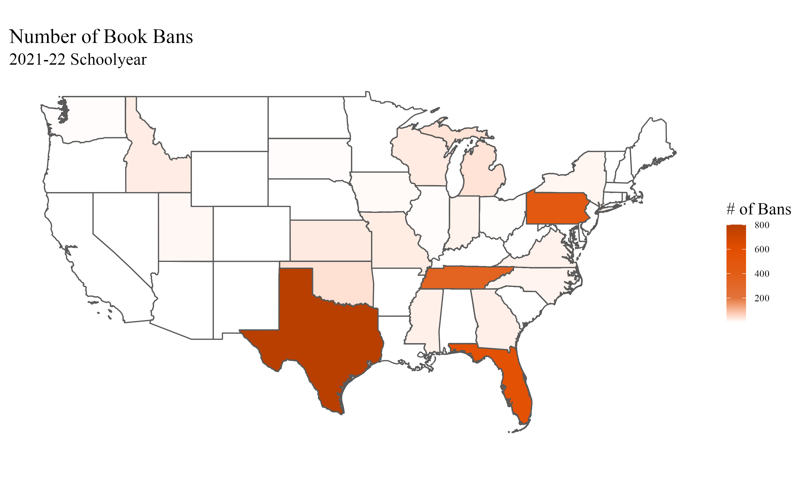
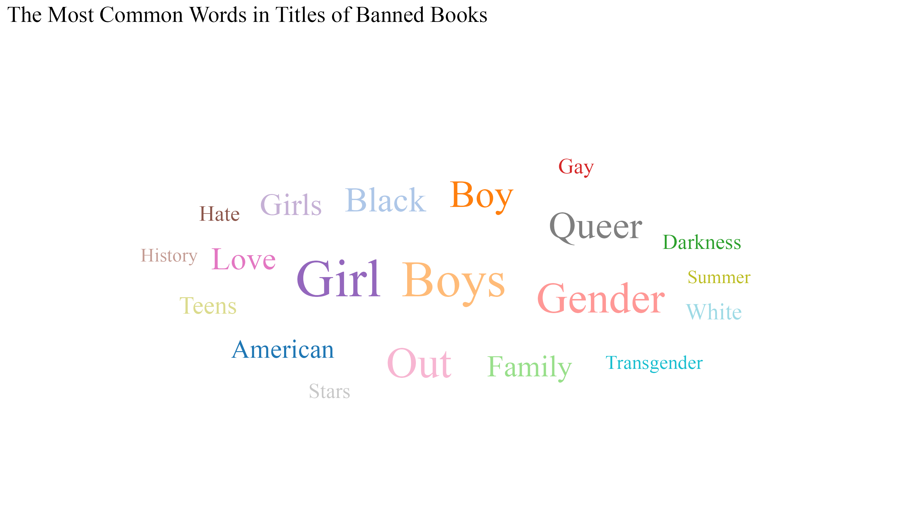
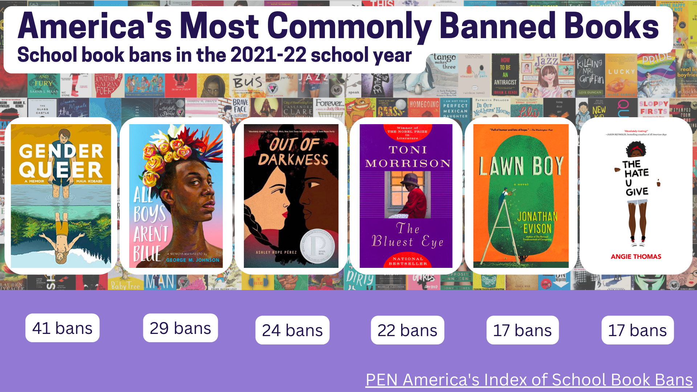
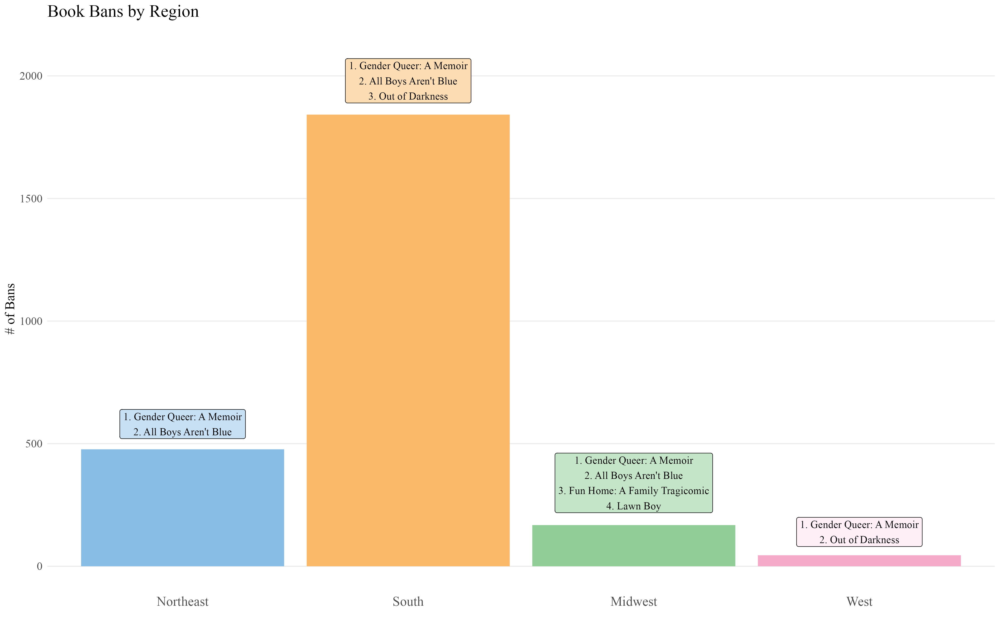
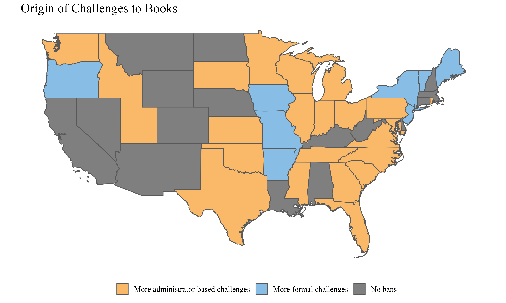
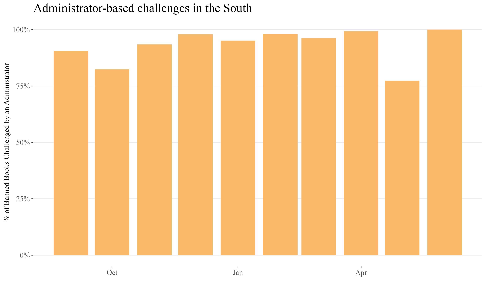

# Final Blog: Book Bans

### Why study banned books?
For centuries, governments and schools have banned books that contradict their goals and values. In the U.S., state and federal legislators as well as individual institutions, like schools and libraries, participated in this practice at many points in history. In the 19th century, there were state bans on anti-slavery writings and federal bans on material considered “obscene” and “immoral”.[1](https://www.nationalgeographic.com/culture/article/history-of-book-bans-in-the-united-states) This continued into the twentieth century with bans, both governmental and individual, on material condemning slavery and segregation as well as books considered pro-communist.[2](https://www.nationalgeographic.com/culture/article/history-of-book-bans-in-the-united-states) Now in the 21st century there is heightened attention on books that include LGBTQ+ and race-related themes and people in power are removing thousands of books each year from classrooms, school libraries, and public libraries.

The most common justifications recently given for banning books were that the material in a given book “was considered to be ‘sexually explicit,’” “contained ‘offensive language,’” and/or “was ‘unsuited to any age group’”.[3](https://www.ala.org/advocacy/bbooks/banned-books-qa) In reality, the two leading commonalities among books banned in schools are the inclusion of LGBTQ+ characters and characters of color.[4](https://pen.org/report/banned-usa-growing-movement-to-censor-books-in-schools/)

Book bans can be harmful because they not only restrict first amendment rights but also young people’s access to representation. Both of these are key to enabling students to form their own opinions about the world and to emotionally support students who, because of their identity, do not see themselves in traditional media.

There was a recent sudden increase in the number of book bans in America with about 1,600 bans in 2021 compared to over 400 in 2020 and over 200 in 2018. Both as a cause and result of this increase, book banning is the topic of many current political discussions.[5](https://www.washingtonpost.com/education/2022/09/19/school-book-bans-challenges-record-highs-are-rising-again/)

### Data Source: PEN America
PEN America is a century-old organization made up of people in the writing industry including novelists, journalists, nonfiction writers, editors, poets, essayists, playwrights, publishers, translators, agents, and readers.[6](https://pen.org/about-us/) In their mission to uphold human rights and free expression, the organization tracked every book ban in American schools during the 2021-22 school year (July 2021 to June 2022). PEN America analysts reviewed news stories, district websites, and letters to school districts and spoke with librarians, authors, and teachers to compile a list of books banned in school libraries, curricula, and classrooms.[7](https://docs.google.com/spreadsheets/d/1hTs_PB7KuTMBtNMESFEGuK-0abzhNxVv4tgpI5-iKe8/edit#gid=1263265416) Their data is published [here](https://docs.google.com/spreadsheets/d/1hTs_PB7KuTMBtNMESFEGuK-0abzhNxVv4tgpI5-iKe8/edit#gid=1171606318).

One potential issue with this data is that there is no way to verify that it includes every single book ban in the country for the 2021-22 school year because each school district publicizes their ban(s) differently. Another potential issue is that some of the bans put in place may have since been revoked, but the data is accurate for the bans that were in place during the 2021-22 school year. Despite these limitations, this dataset is trustworthy because of the comprehensive and diverse methods of data collection.

### What are the common themes among books banned in schools and libraries in the 2021-22 school year?
In the 2021-22 school year, American schools banned 1,648 unique books. Bans were implemented in 32 states across 138 school districts for a total of 2,532 bans, affecting about four million students’ access to literature, representation, and knowledge.

Many of these bans were concentrated in a few states across the country. Because school book bans are put in place as a result of local culture and politics, bans often reflect the culture and politics of people in power in a given state.

Almost half of the over 1,600 book bans in the 2021-22 school year were in Texas. Florida, Pennsylvania, and Tennessee follow with about 500, 400, and 300 bans respectively. These states have some of the most socially conservative politicians and groups in the country. For example, Moms for Liberty, the largest organization dedicated to removing books from schools and libraries, is based in Florida.[8](https://www.tcpalm.com/story/news/2021/12/08/moms-liberty-florida-chapters-members-details/6355142001/)

One common thread among all the states with bans in place is the topics of the banned books.

The two most common words among the titles of banned books are “boys” and “girl”. This indicates a condemnation of books that address topics of gender. Other common words among titles include “queer”, “family”, “black”, and “white”. Together, these words demonstrate a focus on gender and race in the fight to remove books from schools.

There were several books that were banned many times in different school districts within the same states and in different states across the country.

The six books banned the most in American schools during the 2021-22 school year were *Gender Queer: A Memoir*, *All Boys Aren’t Blue*, *Out of Darkness*, *The Bluest Eye*, *Lawn Boy*, and *The Hate U Give*. All but Toni Morrison’s *The Bluest Eye* were published within the past ten years, indicating that proponents of book bans are focused on both new and old literature. These six books all feature an LGBTQ+ protagonist and/or a protagonist of color.

The books above are those most commonly banned across the country, but there is some variance by region. As shown in the map, schools in the South ban more books than any other region, consistent with a historical trend of conservatism.

Note: The number of book titles printed per region is inconsistent because multiple titles were tied for having the next highest number of bans in each region.

The top book banned in all regions, *Gender Queer: A Memoir* focuses primarily on gender and LGBTQ+ themes, but the books with the next highest number of bans varies by region. For example, the book with the second highest number of bans in the West is focused on race while in the Northeast it is a book about gender. The variance across regions may be indicative of which topics proponents of book bans in each region prioritized.

As seen with Gender Queer: A Memoir, many states banned the same books as one another. In fact, as soon as a district in one state banned a given book, districts in other states quickly followed. Below are the timelines of the bans of the top three banned books in the 2021-22 school year.

There was a sudden increase in the number of states banning *Gender Queer: A Memoir*, *All Boys Aren’t Blue*, and *Out of Darkness* in September, most likely due to the start of the school year. After September, though, many additional districts in multiple unique states banned the books each month. This demonstrates the national network of groups fighting to remove certain books, mainly ones about LGBTQ+ themes and race, from schools.

The national trends shown above bring up the question of the origin of individual book bans, as some come from a formal, written challenge while others come from an individual, such as a school administrator, removing a book due to political and/or parental pressure. Local boards of education are primarily responsible for deciding what books to include and exclude from schools, but lobbyists and politicians can greatly influence these decisions.[9](https://www.findlaw.com/education/student-rights/banning-books-and-the-law.html#:~:text=Local%20boards%20of%20education%20are,to%20place%20in%20a%20library)

In most states with banned books, the majority of bans came from an administrator banning the book based on political and/or parental pressure. In the Northeast, though, in which states had fewer bans compared to the rest of the country, the majority of bans came from formal, written challenges. One potential explanation is that all initial bans come from formal challenges, so during the 2022-23 school year districts in the Northeast can expect to have more administrator-based challenges. However, as shown below, there was not a major increase in the percentage of administrator-based challenges in the South over the course of the 2021-22 school year, so there is little evidence that there will be an increase in the Northeast.

Another potential explanation for the region-based differences of the origin of challenges is a difference in social values. Banned books is a major political issue in Southern states, but not so much in Northeastern states. As a result, it takes up less time in everyday social discussions in the Northeast and there may be less political and parental pressure on administrators in Northeastern schools to remove certain books from the libraries and classrooms. This too, though, is subject to change in the future as book banning becomes a more prominent practice and therefore political topic.

### Conclusion
Given the thousands of books banned during the 2021-22 school year and the continued focus on banning additional books, it is essential to maintain awareness of the bans. By studying which books are being banned, how they are banned, and where they are taken from–in which states and from schools and/or libraries–advocates for free speech and representation for children can organize the fight against book bans. They can use data such as the theme, location, and origin of the majority of book bans to decide where to allocate their resources.

### Works Cited
[Bibliography for R projects](https://drive.google.com/file/d/1gnLv5em7xDn9GChnd3dtntDW8-ftfId7/view?usp=sharing)
